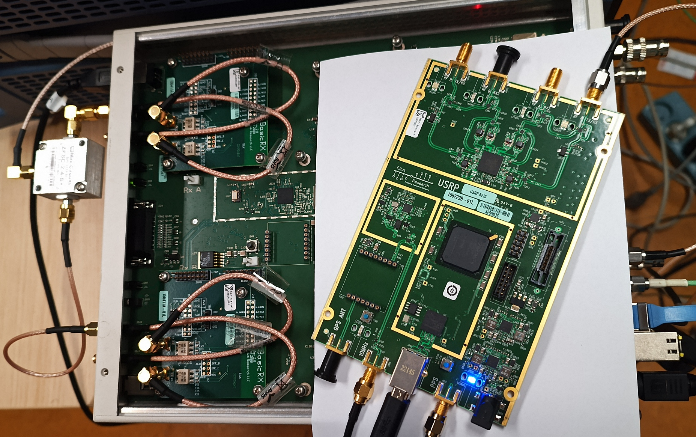
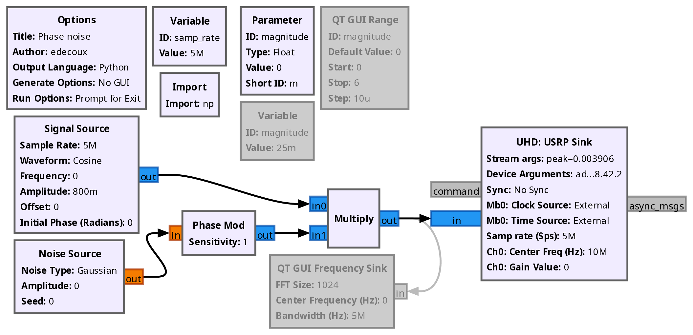
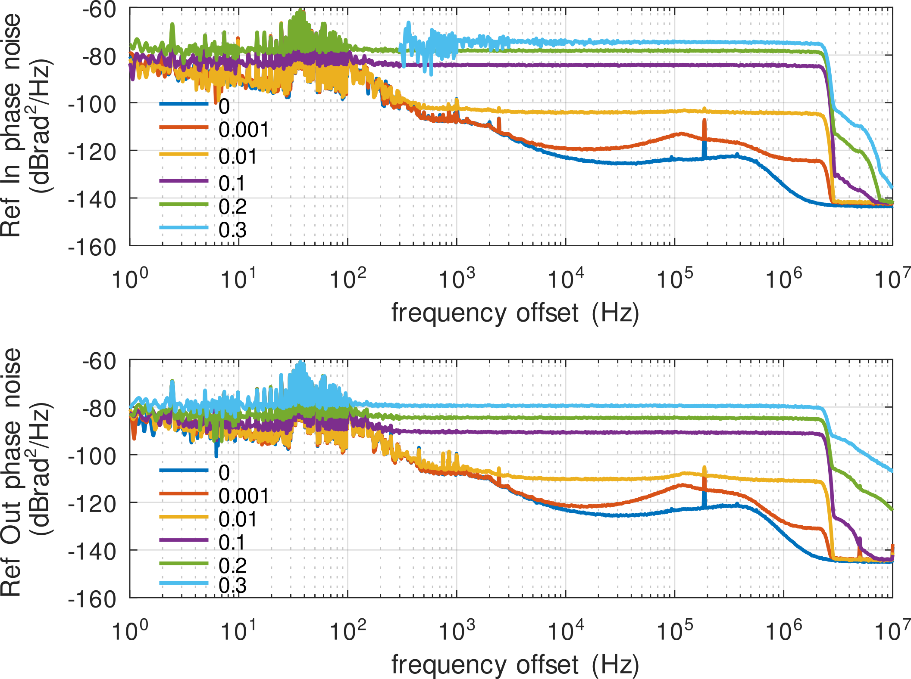
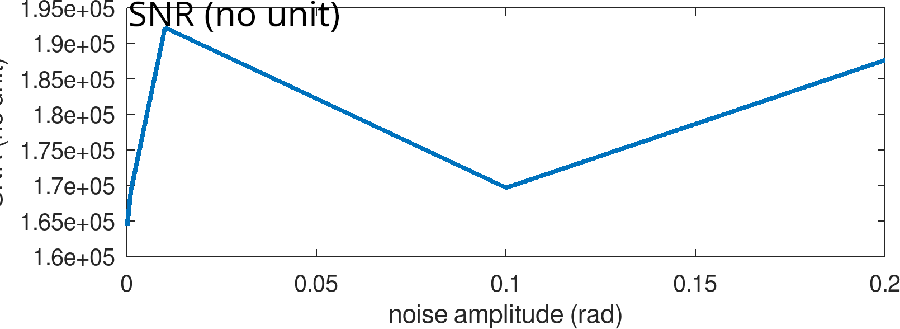
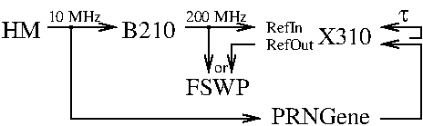
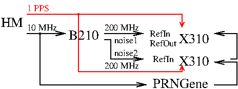

# Experimental setup

B210 SDR outputs 200 MHz.

X310 Ref input (usually 10 MHz) is fed the 200 MHz from the B210.

Challenges: all PLL lock safeties must be removed in both the UHD
library and in the application example.



Based on commit 323d066e648fc6818221c39c854937f372b42fc2 of 
https://github.com/EttusResearch/uhd/, apply the patch
``uhd.diff`` to force the X310 to external source, configuring the
LMK04816 Three Input Low-Noise Clock Jitter Cleaner as Pass Through, and
remove all tests on PLL locking verification.

## Comparison of the phase noise at Ref Out v.s Ref In (B210 output)

``-m`` option of ``phase_noise.py`` to set the phase fluctuation amplitude (set between 0, 0.001, 0.01, 0.1, 0.2, 0.3)

0.3 is the maximum noise the R&S FSWP can handle, above the measurement unlocks. 0.2 is the maximum acceptable by RFNoC.





## Running the B210 as a 200 MHz clock source for the X310

```
$ ./phase_noise.py -m 0.1
[INFO] [UHD] linux; GNU C++ version 16.1.0; Boost_109000; UHD_4.9.0.1-1.4
[INFO] [B200] Detected Device: B210
[INFO] [B200] Operating over USB 2.
[INFO] [B200] Initialize CODEC control...
[INFO] [B200] Initialize Radio control...
[INFO] [B200] Performing register loopback test... 
[INFO] [B200] Register loopback test passed
[INFO] [B200] Performing register loopback test... 
[INFO] [B200] Register loopback test passed
[INFO] [B200] Setting master clock rate selection to 'automatic'.
[INFO] [B200] Asking for clock rate 16.000000 MHz... 
[INFO] [B200] Actually got clock rate 16.000000 MHz.
[INFO] [B200] Asking for clock rate 40.000000 MHz... 
[INFO] [B200] Actually got clock rate 40.000000 MHz.
Press Enter to quit: 
```

## Data acquisition from X310

From the ``build`` directory of ``uhd/host``:
```
$ ./examples/rx_samples_to_file --ref external --args "type=x300" --channels "1,3" --freq 70000000 --rate 5000000 --nsamps 1000000
Creating the usrp device with: type=x300...
[INFO] [UHD] linux; GNU C++ version 16.2.0; Boost_109000; UHD_4.11.0.0-0-g323d066e
[INFO] [X300] X300 initialization sequence...
[INFO] [X300] Maximum frame size: 7972 bytes.
[WARNING] [X300] For the 192.168.41.2 connection, UHD recommends a recv frame size of at least 8000 for best
performance, but your configuration will only allow 7972. This may negatively impact your maximum achievable sample rate.
Check the MTU on the interface and/or the recv_frame_size argument.
[WARNING] [X300] For the 192.168.41.2 connection, UHD recommends a send frame size of at least 8000 for best
performance, but your configuration will only allow 7972. This may negatively impact your maximum achievable sample rate.
Check the MTU on the interface and/or the send_frame_size argument.
JMF2: MODE_DUAL_INT_ZER_DELAY -> MODE_CLOCK_DIST
JMF master: 12
JMF dboad: 24
JMF dboad_clock: 100000000.000000
[INFO] [X300] LMK R00 = 0x00140020
[INFO] [X300] LMK R03 = 0x00140023
[INFO] [X300] LMK R04 = 0x00140024
[INFO] [X300] LMK R05 = 0x00000025
[INFO] [X300] LMK R10 = 0x10004AAA
[INFO] [X300] LMK R11 = 0x8402000B
[INFO] [X300] LMK R13 = 0x7B63024D
_vco_freq = 2400 MHz
_master_clock_rate = 200 MHz
_system_ref_rate = 10 MHz
**** JMF switched to xternal ****
[INFO] [X300] Radio 1x clock: 200 MHz
AD9146: R0A=0xA0 R0C=0xD1 R0D=0xD5 R0E=0x2F R0F=0x0F
AD9146: R0A=0xA0 R0C=0xD1 R0D=0xD5 R0E=0x2F R0F=0x0F
AD9146: R0A=0xA0 R0C=0xD1 R0D=0xD5 R0E=0x87 R0F=0x24
AD9146: R0A=0xA0 R0C=0xD1 R0D=0xD5 R0E=0x86 R0F=0x25
AD9146: R0A=0xA0 R0C=0xD1 R0D=0xD5 R0E=0x87 R0F=0x24
AD9146: R0A=0xA0 R0C=0xD1 R0D=0xD5 R0E=0x86 R0F=0x25
JMF example
Using Device: Single USRP:
  Device: X-Series Device
  Mboard 0: X310
  RX Channel: 0
    RX DSP: 0
    RX Dboard: A
    RX Subdev: BasicRX (0)
  RX Channel: 1
    RX DSP: 1
    RX Dboard: A
    RX Subdev: BasicRX (1)
  RX Channel: 2
    RX DSP: 2
    RX Dboard: B
    RX Subdev: BasicRX (0)
  RX Channel: 3
    RX DSP: 3
    RX Dboard: B
    RX Subdev: BasicRX (1)
  TX Channel: 0
    TX DSP: 0
    TX Dboard: A
    TX Subdev: Unknown (0xffff) - 0
  TX Channel: 1
    TX DSP: 1
    TX Dboard: B
    TX Subdev: Unknown (0xffff) - 0

JMF example
Setting RX Rate: 5.000000 Msps...
Actual RX Rate: 5.000000 Msps...

Setting RX Freq: 70.000000 MHz...
Setting RX LO Offset: 0.000000 MHz...
Actual RX Freq: 70.000000 MHz...

[WARNING] [0/Radio#0] Attempting to set tick rate to 0. Skipping.
[WARNING] [0/Radio#1] Attempting to set tick rate to 0. Skipping.

Done!
```

## Results



One X310 whose input RefIn clock is a 200 MHz reference with controlled phase
fluctuation. A single ADC samples the pseudo-random sequence on both channels,
each fitted with a BasicRX board:



In this condition, the common sampling time is cancelled and the SNR remains constant
irrelevant of the phase noise.

Two X310s are clocked with a different 200 MHz reference clock whose noise source is
generated with a different seed (i.e. decorrelated). Each X310 samples the same PRN
but each ADC is clocked with a different noisy 200 MHz.


